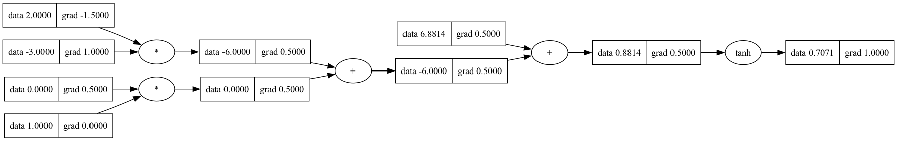

# rust_micrograd
An adaptation of Adrej Kaparthy's micrograd written in Rust.

### Example usage
```rust
fn main() {
    let (_arena_life_time, arena_ref) = Arena::build();
    let vf = ValueFactory::new(arena_ref);

    let a = vf.value(-4.0);
    let b = vf.value(2.0);
    let mut c = &a + &b;
    let mut d = &(&a * &b) + &b.powi(3);
    c = &(&c + &c) + 1.0;
    c = &(&(&c + 1.0) + &c) + &-&a;
    d = &(&d + &(&d * 2.0)) + &(&b + &a).relu();
    d = &d + &(&(3.0 * &d) + &(&b - &a).relu());
    let e = &c - &d;
    let f = e.powi(2);
    let mut g = &f / 2.0;
    g = &g + &(10.0 / &f);
    println!("{:.4}", g.get_data()); // prints 24.7041, the outcome of this forward pass
    g.backward();
    println!("{:.4}", a.get_grad()); // prints 138.8338, i.e. the numerical value of dg/da
    println!("{:.4}", b.get_grad()); // prints 645.5773, i.e. the numerical value of dg/db
}
```

Every value object will only live as long as `_arena_life_time`. All binary operations must be performed on references to the `Value` structs as to not consume/copy the objects. The `Value`s cannot be copied (only cloned) since they are implemented with shared pointers.

### Training a neural net
`example_training_loop` in `main.rs` shows an example of how the `Modules` in `nn.rs` use `Value`s to compose a neural network. `example_training_loop` creates and trains a simple neural network.

### Tracing / visualization
The `Value` struct implements a `draw_dot` method. The method returns a string that can be used directly with graphviz to visualize the autograd graph. The `example_expression_with_dot` function in `main.rs` shows how rust can interface with the graphviz command `dot -Tpng graph.dot -o graph.png` to draw the graph.


### Unit tests
`engine.rs` contains unit tests that demonstrate extensive usage of the `Value` structs.
